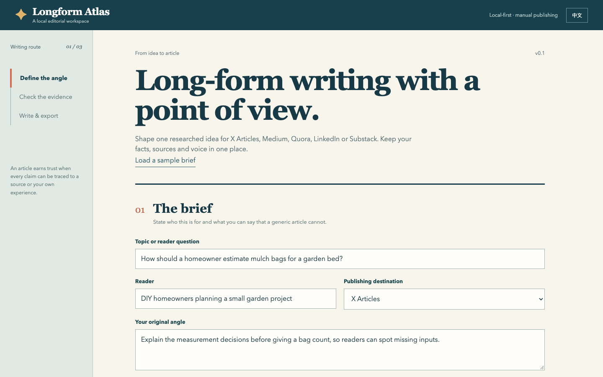

# Longform Atlas · 长文航图

**One researched idea → five distinct long-form formats.**

**把一个有证据的选题，写成适合海外平台的英文长文。**

Longform Atlas is a local writing workspace for creators publishing on **X Articles, Medium, Quora, LinkedIn and Substack**. It keeps the reader, original angle, evidence, sources, search intent and editable Markdown draft together. Build an outline entirely offline, or connect your own OpenAI-compatible model endpoint to generate a full first draft. Review and publish manually.

This is a workflow tool, not a ranking guarantee or an auto-posting bot. It is designed for evidence-led, original writing rather than keyword stuffing.



The built-in sample demonstrates the workflow; it is not a claim of published results. [See the editable offline outline and export controls](docs/screenshots/draft-workflow.png).

## What it does / 功能

- Chinese and English interface; article language is a separate setting / 中英文界面与文章语言分别切换。
- Platform-specific prompts for five overseas publishing destinations / 五个平台的不同文章结构。
- Source ledger, first-hand evidence and original-angle fields / 来源台账、亲身经验和独特观点。
- Search phrase, reader intent and canonical-original URL fields / 搜索词、搜索意图与转载原文链接。
- Offline outline, optional full draft through your own model API / 离线大纲或自带模型 API 生成长文。
- Editable Markdown, copy/download and a basic structure check / 编辑、导出和结构检查。
- Local browser storage for the project; API key stays in the current page only / 项目存于本机浏览器，API 密钥不持久化。
- No account connection, auto-publishing, scheduling or fabricated analytics / 不登录平台、不自动发布、不编造流量效果。

## Quick start

Requires Python 3.9+; no Python packages or build step.

```bash
python3 app.py
```

On Windows, run `start-windows.bat` with Python 3 installed. On macOS, run `start-mac.command` or the command above.

Open `http://127.0.0.1:8765`. Click **Load a sample brief** and **Build offline outline** to test immediately. For a full article, supply your own compatible HTTPS base URL, model and API key, then press **Generate article**. The server accepts localhost HTTP for a local model. The app sends the brief and key to that chosen provider only for this click; it does not save the key.

运行 `python3 app.py`，打开本机地址；点击「载入示例选题」与「离线生成大纲」即可测试。生成完整初稿时再填写自己的兼容 API 地址、模型和密钥。

The generated text can still contain mistakes. Check all claims and source links, edit the prose in the app, then export Markdown and publish from your own account.

## Platform fit

| Destination | Best use in this tool | Current publication detail |
| --- | --- | --- |
| X Articles | Original analysis with a strong hook and sections | Publishing requires eligible X Premium/Business/Organization access ([X Help](https://help.x.com/en/using-x/articles)). |
| Medium | Evergreen story and republishing | Medium supports canonical links for imported/republished work ([Medium Help](https://help.medium.com/hc/en-us/articles/360033930293-Set-a-canonical-link)). |
| Quora | Direct answer to a specific reader question | Earnings are a separate, eligibility-dependent program ([Quora Help](https://help.quora.com/hc/en-us/articles/360059643172-What-earnings-programs-are-available-to-writers-on-Quora)). |
| LinkedIn | Professional how-to or lesson | Article SEO title and description can be edited ([LinkedIn Help](https://www.linkedin.com/help/linkedin/answer/a6278775)). |
| Substack | Newsletter essay and owned reader relationship | Publishing can start free; paid subscriptions have a platform fee ([Substack Help](https://support.substack.com/hc/en-us/articles/360037607131-How-much-does-Substack-cost)). |

Platform features and eligibility change; verify the current account and platform documentation before publishing. Google does not guarantee a page will be indexed or ranked ([Google Search Central](https://developers.google.com/search/docs/fundamentals/how-search-works)).

## Architecture and privacy

`app.py` runs a loopback-only HTTP server with a per-process local request token. Static assets live in `web/`. The optional generation request is sent through the local server to the user-entered provider. The server does not log request bodies or keys. Project fields and drafts are saved in this browser's `localStorage`; the API key is not.

No platform accounts, cookies or publishing APIs are used. The source ledger does not scrape linked pages; users provide and verify evidence.

## Development

```bash
python3 -m unittest discover -s tests -v
node --check web/app.js
```

See [design notes](docs/DESIGN.md), [Chinese quick guide](README.zh-CN.md), and [LICENSE](LICENSE).
