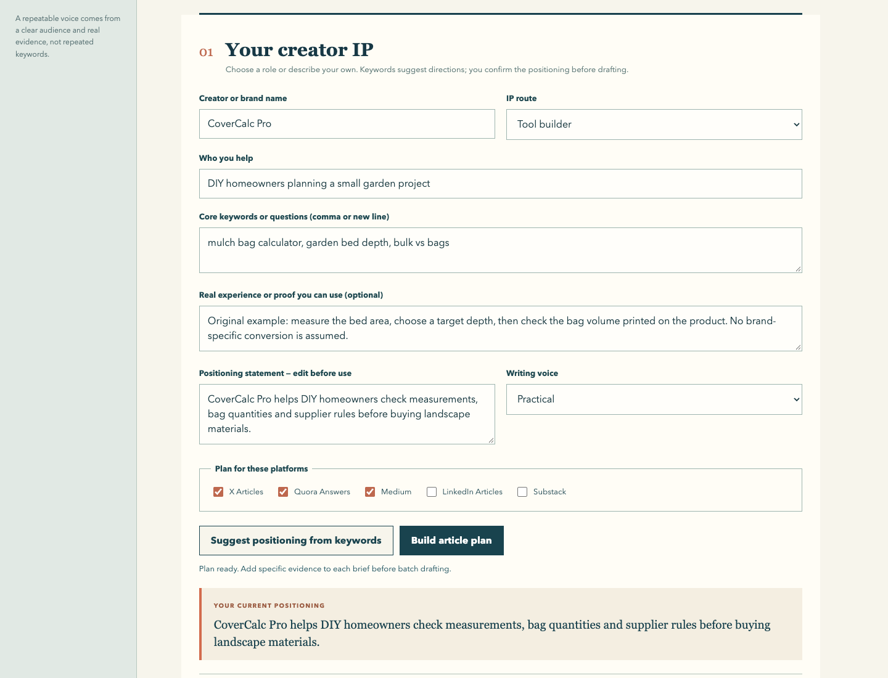

# 海外长文 SEO 量产 · Longform Atlas



[查看跨平台选题计划](docs/screenshots/ip-plan-desktop.png)与[离线大纲及导出区域](docs/screenshots/draft-workflow.png)。截图只展示内置示例，不代表已发布文章或获得流量。

一款面向海外平台的本地长文写作工作台。先输入关键词和目标读者，让工具建议一个内容 IP，或自己选择实操型、工具构建型、研究整理型、购买决策型并写定位。围绕这个定位，为 **X Articles、Quora Answers、Medium、LinkedIn Articles、Substack** 生成不同选题；每篇补充真实材料和来源后，写英文或中文稿。

## 立即体验

**[下载 v0.2.0 ZIP](https://github.com/LydiaTools/longform-atlas/releases/download/v0.2.0/longform-atlas-v0.2.0.zip)** · [查看版本说明](https://github.com/LydiaTools/longform-atlas/releases/tag/v0.2.0)

解压后进入 `longform-atlas-v0.2.0` 文件夹。电脑安装 Python 3.9 或更新版本后，在该文件夹执行：

```bash
python3 app.py
```

Windows 可双击 `start-windows.bat`；macOS 可运行 `start-mac.command`。

浏览器打开 `http://127.0.0.1:8765`，点击「载入示例 IP 与选题」「生成长文选题计划」，再选一篇「放入单篇编辑器」「离线生成大纲」。这几步不需要 API 密钥。想生成完整初稿时，在「可选写作模型」中填写自己的兼容 API 地址、模型与密钥。批量写作最多选三篇，并须逐篇补充证据；每篇独立成稿，结果保存在本机，失败时停止，不自动重试。

写作界面和文章语言是两个独立选项。完成后检查事实和来源，导出 Markdown，再用自己的账号手动发布。

## 为什么没有自动发布

平台分工：**X Articles** 适合观点鲜明的分节长文，发布需符合条件的订阅；**Quora Answers** 要直接回答具体问题，披露相关利益关系；**Medium** 适合常青文章，转载时可设置 canonical；**LinkedIn Articles** 适合专业经验、可设置 SEO 标题和描述；**Substack** 适合连载文章与 newsletter。工具只负责研究、写作和导出，不代替账号资格判断，也不承诺收录、排名或收益。相关规则见[英文 README 的官方链接](README.md#platform-fit)。

IP 定位、选题与草稿存于当前浏览器，本地服务器只监听 `127.0.0.1`。API 密钥不写进本地存储；点击生成时会发送给你填写的模型服务商。
